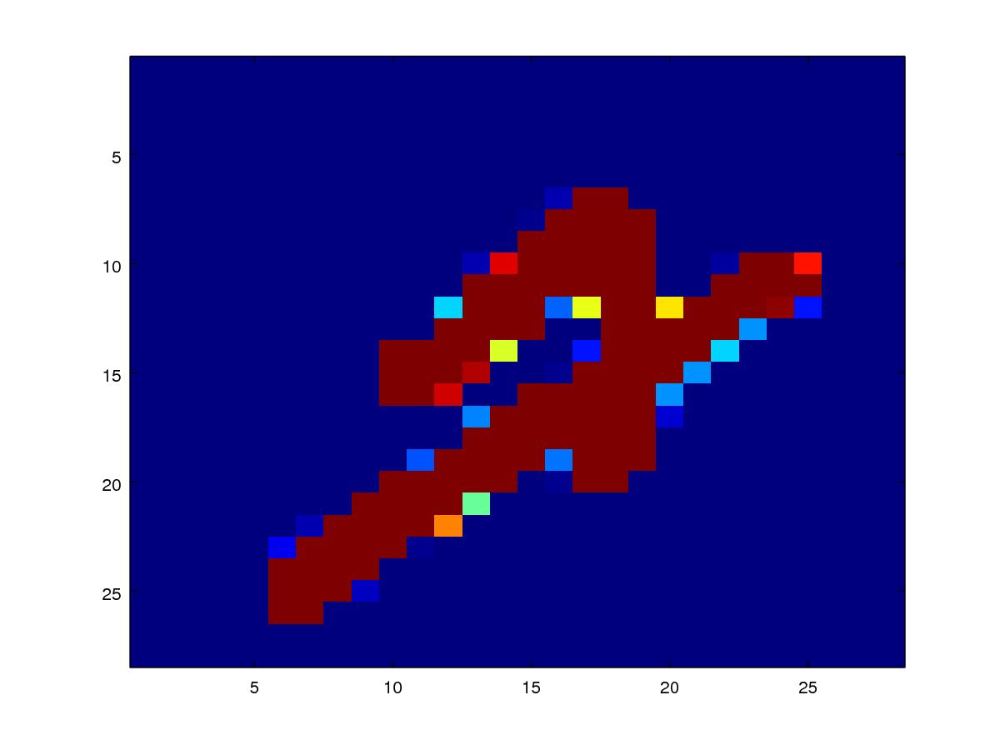
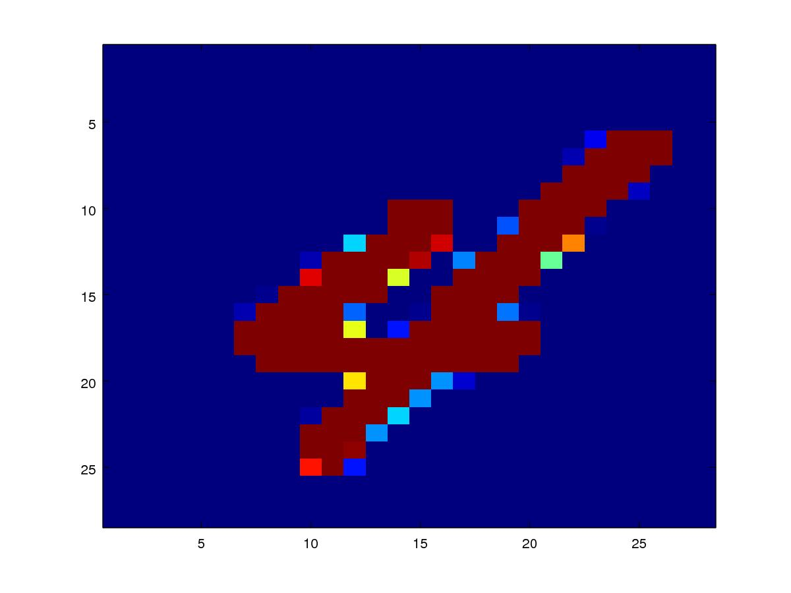
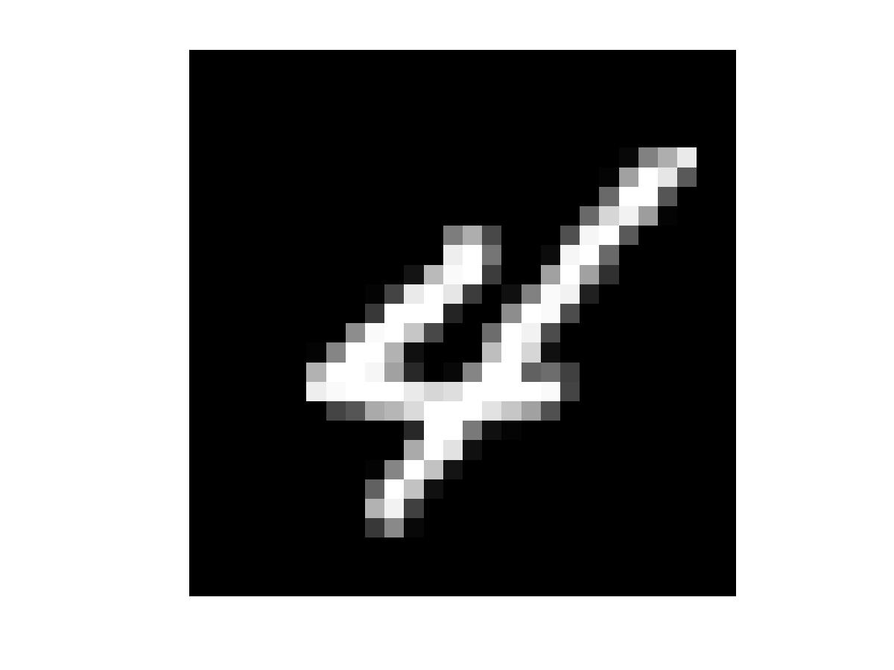

# 加载 MNIST 训练数据精解

本文将详细介绍手写数字数据 MNIST 的加载，以及将数据调制为适合用于机器学习训练的格式。

## 下载数据

我们首先需要从 [MNIST](http://yann.lecun.com/exdb/mnist/) 数据官网下载手写数字数据。数据库分为 4 个文件：

 * [train-images-idx3-ubyte.gz](http://yann.lecun.com/exdb/mnist/train-images-idx3-ubyte.gz):         training set images (9912422 bytes)
 * [train-labels-idx1-ubyte.gz](http://yann.lecun.com/exdb/mnist/train-labels-idx1-ubyte.gz):           training set labels (28881 bytes)
 * [t10k-images-idx3-ubyte.gz](http://yann.lecun.com/exdb/mnist/t10k-images-idx3-ubyte.gz):         test set images (1648877 bytes)
 * [t10k-labels-idx1-ubyte.gz](http://yann.lecun.com/exdb/mnist/t10k-labels-idx1-ubyte.gz):           test set labels (4542 bytes)

四组数据分别是：训练图像；训练标签；测试图像；测试标签。分别下载这4组数据，例如：

``` shell
$ wget http://yann.lecun.com/exdb/mnist/train-images-idx3-ubyte.gz
```

接着，可以用 `gunzip` 工具将它们分别解压，如：

``` shell
$ gunzip -dv train-images-idx3-ubyte.gz
```

解压之后，得到一个 IDX 格式的文件，文件名是 `train-images-idx3-ubyte`。我们不必深究 IDX 文件格式的问题，我们直接根据 MNIST 官网上对文件格式的描述来分析文件的数据结构即可。

## 查看数据

这里以加载训练图像数据集文件 `train-images-idx3-ubyte` 作为例子来介绍文件的加载方法，另外三个文件可以此类推。

### Images 文件的数据格式

下面是 MNIST 官方网页上，对训练图像数据的格式说明。

```
TRAINING SET IMAGE FILE (train-images-idx3-ubyte):

[offset] [type]          [value]          [description] 
0000     32 bit integer  0x00000803(2051) magic number 
0004     32 bit integer  60000            number of images 
0008     32 bit integer  28               number of rows 
0012     32 bit integer  28               number of columns 
0016     unsigned byte   ??               pixel 
0017     unsigned byte   ??               pixel 
........ 
xxxx     unsigned byte   ??               pixel
Pixels are organized row-wise. Pixel values are 0 to 255. 0 means background (white), 255 means foreground (black).
```

如上所述，文件的的开始 16 个字节，分为 4 段，每段 4 个字节，分别表示：文件标识符（magic）；图像个数；每个图像的行数；每个图像的列数。我们需要验证一下我们下载与解压的文件是否正确：

``` shell
$ xxd -c 4 -l 16 train-images-idx3-ubyte 
00000000: 0000 0803  ....
00000004: 0000 ea60  ...`
00000008: 0000 001c  ....
0000000c: 0000 001c  ....
```

我们先检查一下文件标识符是否是 2051：

``` shell
$ ((magic=0x0803))
$ echo $magic
2051
```

再检查训练图像的数量是否是 60000：

``` shell
$ ((numImages=0xea60))
$ echo $numImages
60000
```

其他的诸如图像的行列数等等，可以参照检查。

## 加载数据

在这里我们采用开源社群的数学工具 Octave 来加载与调制训练用的图像数据。其他的训练用数据可以参考这个章节的内容来加载。

按照官方的说法，16个字节之后的内容就全部是图像数据了，并且每个像素以一个 `unsigned char` 来表示它的值，所以每个像素的值是 0～255。

我们首先进入 Octave 的运行环境。在终端窗口下运行：

``` shell
$ octave-cli
```

之后，我们将看到 octave 的运行环境提示符：

``` octave
octave:1> 
```

这样，已经表示我们已经进入了 octave 的运行环境之中。

> 根据本人长期使用 Linux 作为开发平台的经验，Octave 的图形界面开发环境，自“古”以来都从来没有稳定过，因此，不推荐大家使用。命令 `octave-cli` 是进入 octave 的命令行环境的，它非常稳定，而且我认为其实比图形界面更加方便。

### 文件 I/O 控制与信息加载

下面我们通过一系列 octave 的内置函数来打开文件 I/O，并且分别加载文件中的数据。

打开文件 I/O：

``` octave
octave:3> fp = fopen('train-images-idx3-ubyte', 'rb')
fp =  4
```

> 函数的第二个参数 'rb' 中的 r 表示文件以只读模式打开，b 表示以二进制（binary）的数据格式打开。

加载各项文件信息：

``` octave
octave:3> magic = fread(fp, 1, 'int32', 0, 'ieee-be')
magic =  2051
octave:4> numImages = fread(fp, 1, 'int32', 0, 'ieee-be')
numImages =  60000
octave:5> numRows = fread(fp, 1, 'int32', 0, 'ieee-be')
numRows =  28
octave:6> numCols = fread(fp, 1, 'int32', 0, 'ieee-be')
numCols =  28
```

上述操作加载的训练数据信息分别是：文件识别符；图像数量；单个图像的行数；单个图像的列数。

> 这里需要说明的是 octave 的 `fread` 函数是通过 C 库的文件 I/O 函数来操作的，它隐含一个文件 I/O 的位置游标（position indicator）。octave 每次的文件 I/O 操作，无论是 `fread` 还是 `fwrite` 等等，它都会将文件的作业游标增加一个偏移量。这个偏移量等于函数的第二个参数 'SIZE' 与第三个参数 'PRECISION' 的乘积。
>
> 我们可以通过 `ftell` 函数来查看当前的作业游标位置，也可以通过 `fseek` 函数来设置游标位置。例如：
>
> ``` octave
> octave:7> ftell(fp)
> ans =  16
> ```
> 16 个字节的偏移，正好就是我们已经加载过的文件信息的长度。

### 加载图像数据

现在到了本章的核心内容。根据 MNIST 官方的说法：“Pixels are organized row-wise. Pixel values are 0 to 255. 0 means background (white), 255 means foreground (black).”。就是说，图像是以逐行串行的方式来保存的，并且每个像素有一个 8 位二进制无符号数表示，即它的值为 0～255。

我们完全可以创建一个 28 \* 28 \* 60000 的 3 维数组将数据逐个地循环填充进去。 在这里我们不打算这样做，而且是利用 octave 内置的数组与矩阵操作函数来实现数据格式的调制。

``` octave
octave:10> images = fread(fp, inf, 'unsigned char');
```

上述操作中，参数 'inf' 指示 octave 尽可能地加载文件的所有剩余数据，数据的单位是 `unsigned char` 。此时的  images 是一个超大的单列向量（column vector）。

至此，未来将要用到的训练图像数据，已经加载到计算机的内存中。在任何对外设的操作作业中，**尽快关闭文件 I/O 是软件工程师必须养成的良好习惯**：

``` octave
octave:12> fclose(fp)
ans = 0
```

## 训练数据的调制

还记得官方的说法吗？“Pixels are organized row-wise.”，就是说它是按行来排布数据的。现在的 images 是一个大的 column vector，相当于数据被转置的 $90^{\circ} $ ，我们暂时先搁置这个问题。

### 将数据调制为 3 维数组

首先将数据整形为 3 维的格式：

``` octave
octave:14> images = reshape(images, numCols, numRows, numImages);
```

通过 `reshape` 函数，我们将数据整形为一个 28 x 28 x 60000 的 3 维数组。形象的比喻是，此时的数据调制为一叠 60000 张的卡片，每张卡片上印刷有一张 28 x 28 个像素的图片。让我们抽出其中的第 128 张卡片来看看是什么东西：

``` octave
octave:34> image(images(:, :, 128))
```

Octave 输出如下的图像（Figure 1）：


这似乎是一个转置过 $90^{\circ}$，并且被翻转过的数字 '4'。

### 共轭转置

正如我们上面所述，现在我们的数据 images 的格式，与官方数据的格式正好是行列对掉的。我们利用 octave 的内建函数 `permute` 将数据转置过来。

``` octave
octave:36> images = permute(images, [2 1 3]);
```

**理解共轭转置的关键**是函数的第二个参数 `[2 1 3]` 。它定义了共轭转置的规则，即：新数组中的第 1 个坐标轴的数据，由旧数组的第 2 个坐标轴数据来替换；新数组中的第 2 个坐标轴的数据，由旧数组中的第 1 个坐标轴的数据来填充。这就相当于，将原来的 `images` 数组的每张图片的行列数据都逐一交换了一次。

现在我们再次打印出第 128 个图片看看：

``` octave
octave:39> image(images(:, :, 128))
```

我们将看到如下图像（Figure 2）：


现在我们可以很确定第 128 张图片是数字 '4' 了。

#### 共轭转置的几何意义

在我们这个例子中，共轭转置的几何意义相当于将 Figure 1 从左上至右下画一条对角线，然后，Figure 1 的整份数据，以这条对角线为转轴，翻转 $180^{\circ}$ 。从而实现整个矩阵的行列数据交换得到 Figure 2 。

### 调制数据为双精度浮点（double）

由于我们加载的这些图片，最终都是要导入到神经网络中进行前向传播计算的。而当前的神经网络的单元数据一般采用双精度浮点数（double），因此，我们需要将数据进一步调制。

``` octave
octave:44> images = double(images/255);
```

我们仍然以第 128 个图片来查看是否调制为浮点数，我们取第 12 x 12 这个数来查看：

``` octave
octave:51> images(12, 12, 128)
ans =  0.086275
```

还是输出图片来看个究竟吧：

``` octave
octave:57> imshow(images(:, :, 128))
```

得到图片如下（Figure 3）：


上面的这张灰度图，就是即将用于神经网络训练的，单张图片的数据格式了！

## 总结

很容易想到的，就是将我们上述在 octave 环境下的交互操作写成为一个函数。实际上，这些交互操作，也是我从网上找的一些开源项目的源代码中整理的。我演示的这些操作，都是为了方便说明问题来组织的。在真实的工程项目中，情况可能会精细很多。譬如，可以考虑支持机器学习的小批量（mini-patch）训练的加载方式等等。即使是现在的这个 3 维数组的数据组织形式，也是可能根据未来项目发展来修改。